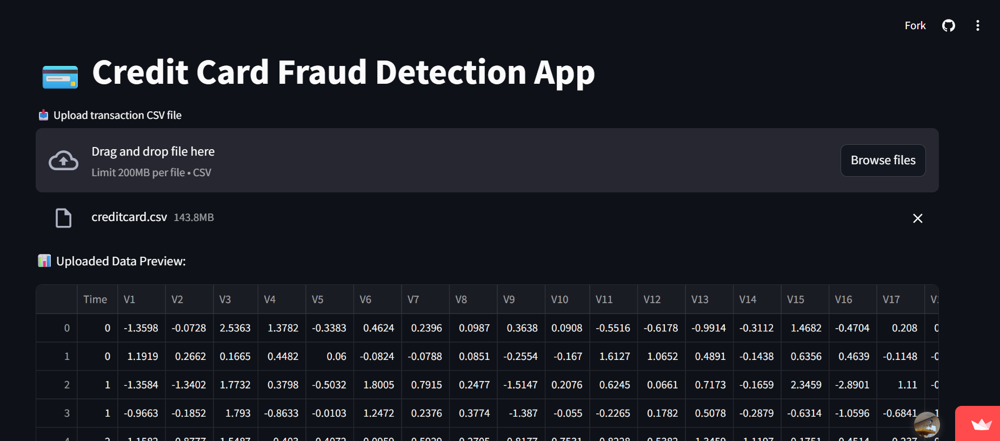
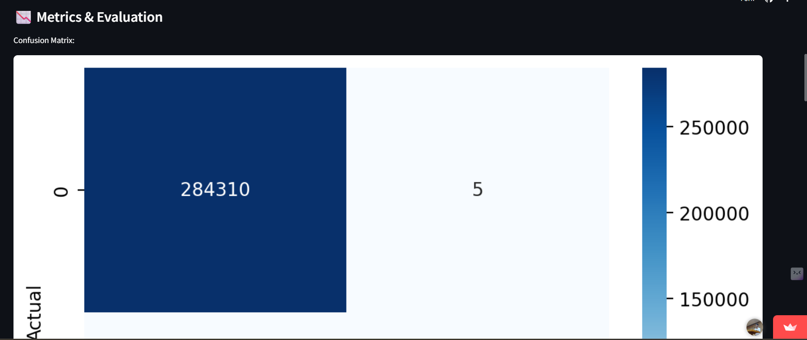
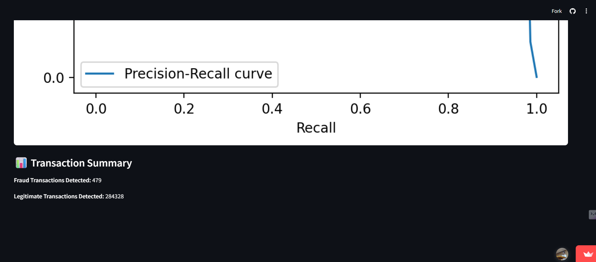

# Fraud Transaction Detection

## Overview
Fraud Transaction Detection is a machine learning-based project designed to identify and prevent fraudulent transactions. This project leverages a trained model to classify transactions as either legitimate or fraudulent, ensuring secure and reliable financial operations.

## Features
- Pre-trained fraud detection model (`fraud_model.pkl`)
- Easy-to-use interface for transaction classification
- Modular code structure for extensibility

## Upload data

## Evaluation of Model

## Result

## Tech Stack

The project utilizes the following technologies and tools:

### Programming Language
- **Python**: The primary programming language used for building the application.

### Libraries and Frameworks
- **Pandas**: For data manipulation and preprocessing.
- **Scikit-learn**: For machine learning model training and evaluation.
- **Flask and Streamlit**: For building the web application interface.

### Tools
- **Pickle**: For saving and loading the pre-trained model.

### Environment
- **pip**: For managing Python dependencies.
- **Virtual Environment**: Recommended for isolating project dependencies.

### Version Control
- **Git**: For version control and collaboration.

### Operating System
- Compatible with Windows, macOS, and Linux.

## Working Process
1. Data Preprocessing:
The input transaction data is preprocessed using utility functions in utils.py.

2. Model Loading:
The pre-trained model (fraud_model.pkl) is loaded using the model.py script.

3. Prediction:
The application takes transaction data as input and uses the model to predict whether the transaction is fraudulent or legitimate.

4. Output:
The result is displayed to the user, indicating whether the transaction is safe or fraudulent.

5. Project Structure :
Fraud_Transaction_Detection/

├── .gitignore├── README.md├── app.py├── fraud_model.pkl├── model.py├── requirements.txt└── utils.py

- app.py: Main application script.
- model.py: Script for loading and interacting with the fraud detection model.
- utils.py: Utility functions for data preprocessing.
- fraud_model.pkl: Pre-trained fraud detection model.
- requirements.txt: List of dependencies.

